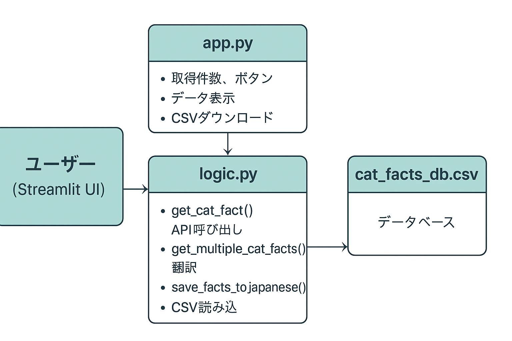

# 🐈ネコ豆知識app

## 概要
ネコの豆知識を知りたい数だけ「－」「＋」をタップして増減し、取得！をタップして取得してください。  
表示した豆知識を再確認したい場合は「データベースを表示」ボタンをタップすることで確認できます。

## 使用API
[Cat Facts API](https://catfact.ninja/fact)  
※ APIキー不要

## データベース機能
取得したネコ豆知識は `'cat_facts_db.csv'` に保存されます。（加点対象）

## システム設計図

## コード構成図

## デプロイ先
- GitHub URL:(https://github.com/chihi0905/22060014_-_AI-2)
- アプリURL:https://22060014-ai-2-jzxxcp6fhzmvyv6ip9yaa2.streamlit.app/
- improvement.md URL:(https://github.com/chihi0905/22060014_-_AI-2/blob/main/improvement.md)
